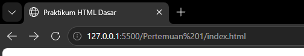
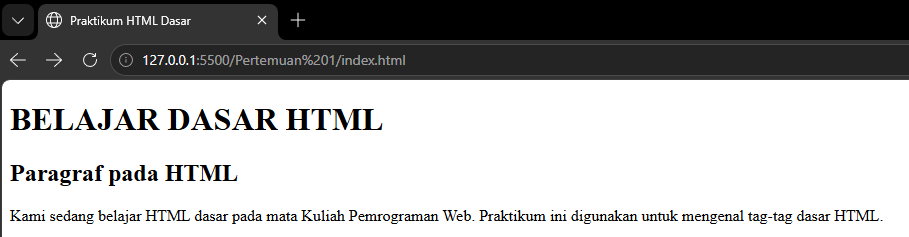
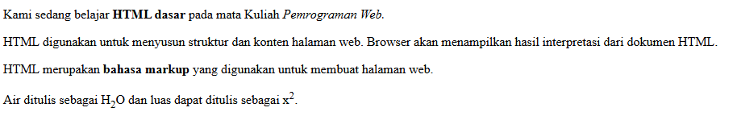
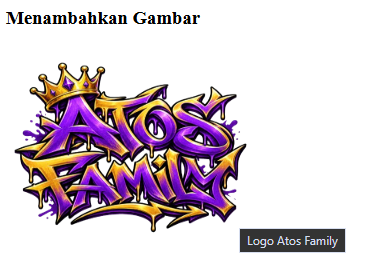
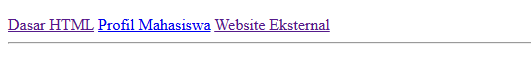
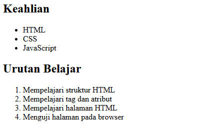
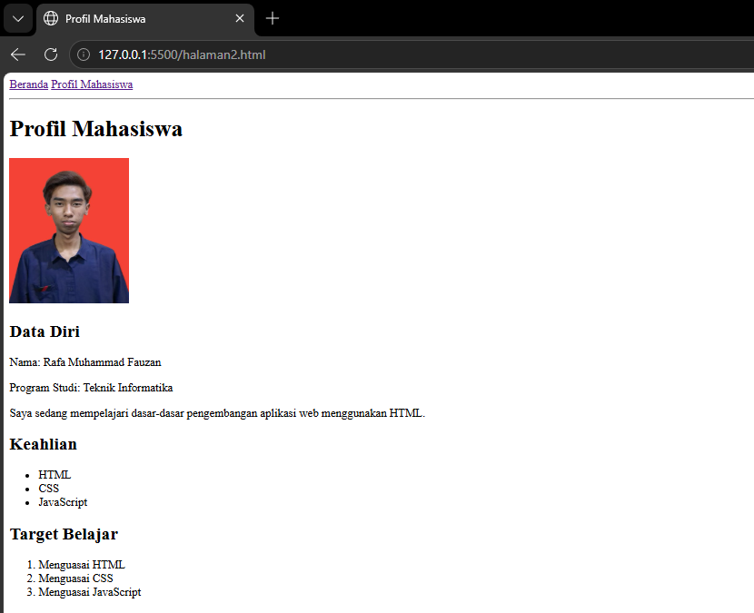
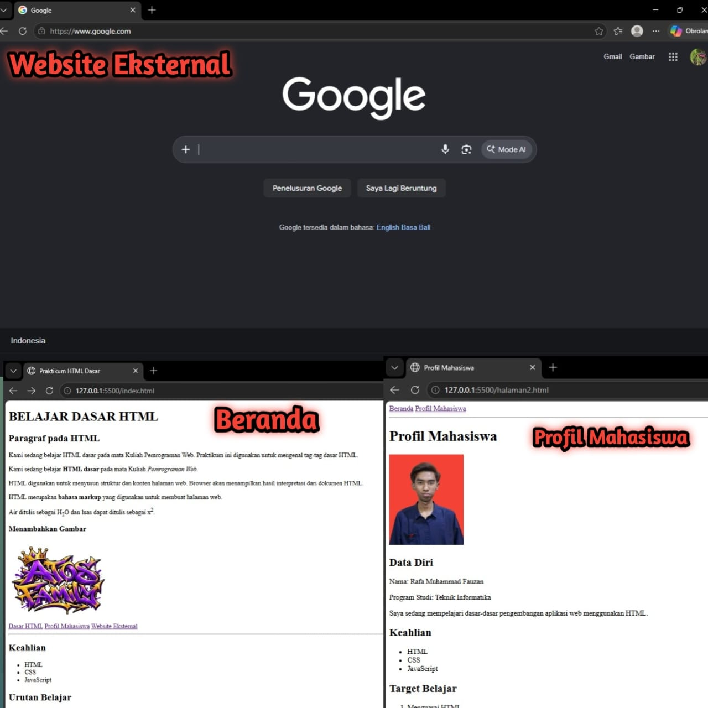
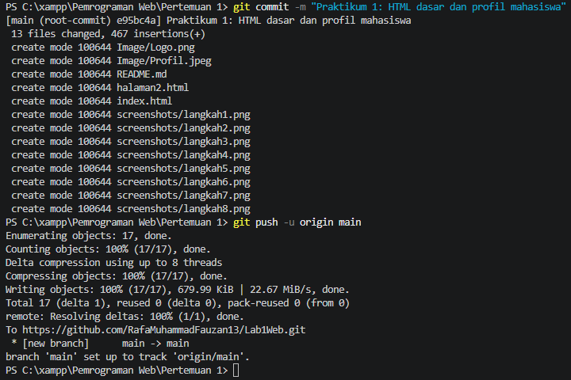

# Lab1Web - Praktikum 1 Pemrograman Web

| | |
|---|---|
| **Nama** | Rafa Muhammad Fauzan |
| **Program Studi** | Teknik Informatika |
| **Mata Kuliah** | Pemrograman Web |
| **Topik** | Dasar-dasar HTML |

## Deskripsi

Repository ini berisi hasil Praktikum 1 Pemrograman Web. Praktikum ini bertujuan untuk mengenal tag-tag dasar HTML, mulai dari struktur dokumen, teks, gambar, tautan (link), daftar (list), hingga membuat halaman profil mahasiswa.

## Struktur Repository

```
Lab1Web/
├── index.html          # Halaman 1: Belajar Dasar HTML
├── halaman2.html       # Halaman 2: Profil Mahasiswa
├── Image/
│   ├── Logo.png        # Gambar di halaman utama
│   └── Profil.jpg      # Gambar di halaman profil
├── screenshots/        # Screenshot hasil tiap langkah praktikum
└── README.md
```

## Tujuan Praktikum

1. Memahami struktur dasar dokumen HTML.
2. Menggunakan tag heading, paragraf, dan pemformatan teks.
3. Menampilkan gambar dengan atribut yang benar.
4. Membuat navigasi dan tautan antarhalaman maupun ke website eksternal.
5. Membuat daftar tidak berurutan (`<ul>`) dan berurutan (`<ol>`).
6. Membuat halaman profil mahasiswa yang saling terhubung dengan halaman utama.

## Alat yang Digunakan

- Text editor (misalnya Visual Studio Code)
- Web browser (misalnya Google Chrome)
- Git dan GitHub

---

## Langkah 1: Membuat Struktur Dasar HTML

Langkah pertama adalah membuat file `index.html` dengan kerangka dokumen HTML5.

```html
<!DOCTYPE html>
<html lang="en">
<head>
    <meta charset="UTF-8">
    <meta name="viewport" content="width=device-width, initial-scale=1.0">
    <title>Praktikum HTML Dasar</title>
</head>
<body>

</body>
</html>
```

**Penjelasan:**

| Tag | Fungsi |
|---|---|
| `<!DOCTYPE html>` | Memberi tahu browser bahwa dokumen ini menggunakan HTML5. |
| `<html lang="en">` | Elemen akar (root) yang membungkus seluruh isi dokumen. Atribut `lang` menentukan bahasa dokumen. |
| `<head>` | Berisi informasi tentang dokumen (metadata) yang tidak tampil di halaman. |
| `<meta charset="UTF-8">` | Menentukan pengkodean karakter agar huruf dan simbol tampil dengan benar. |
| `<meta name="viewport" ...>` | Mengatur tampilan agar menyesuaikan lebar layar perangkat. |
| `<title>` | Judul halaman yang muncul pada tab browser. |
| `<body>` | Berisi seluruh konten yang tampil di halaman. |

**Hasil:**



---

## Langkah 2: Menambahkan Heading dan Paragraf

Di dalam `<body>`, ditambahkan judul utama, subjudul, dan beberapa paragraf.

```html
<!-- Judul Utama -->
<h1>BELAJAR DASAR HTML</h1>
<!-- Subjudul -->
<h2>Paragraf pada HTML</h2>
<!-- Ini adalah paragraf pertama -->
<p>
    Kami sedang belajar HTML dasar pada mata Kuliah Pemrograman Web.
    Praktikum ini digunakan untuk mengenal tag-tag dasar HTML.
</p>
```

**Penjelasan:**

- `<h1>` sampai `<h6>` adalah tag heading. `<h1>` adalah tingkat tertinggi (paling besar), sedangkan `<h6>` paling kecil. Pada praktikum ini dipakai `<h1>`, `<h2>`, dan `<h3>`.
- `<p>` adalah tag paragraf. Browser otomatis memberi jarak antarparagraf.
- `<!-- ... -->` adalah komentar. Isinya tidak ditampilkan di browser dan hanya berfungsi sebagai catatan bagi programmer.

**Hasil:**



---

## Langkah 3: Pemformatan Teks

Pada paragraf kedua sampai kelima, digunakan tag pemformatan teks.

```html
<p>
    Kami sedang belajar <b>HTML dasar</b> pada mata Kuliah <i>Pemrograman Web.</i>
</p>
<p>
    HTML digunakan untuk menyusun struktur dan konten halaman web.
    Browser akan menampilkan hasil interpretasi dari dokumen HTML.
</p>
<p>
    HTML merupakan <strong>bahasa markup</strong> yang digunakan untuk membuat halaman web.
</p>
<p>
    Air ditulis sebagai H<sub>2</sub>O dan luas dapat ditulis sebagai x<sup>2</sup>.
</p>
```

**Penjelasan:**

| Tag | Fungsi | Contoh hasil |
|---|---|---|
| `<b>` | Menebalkan teks (hanya tampilan). | **HTML dasar** |
| `<i>` | Memiringkan teks (hanya tampilan). | *Pemrograman Web* |
| `<strong>` | Menandai teks yang penting, tampil tebal. Lebih bermakna secara semantik daripada `<b>`. | **bahasa markup** |
| `<sub>` | Membuat teks subskrip (turun ke bawah). | H₂O |
| `<sup>` | Membuat teks superskrip (naik ke atas). | x² |

**Hasil:**



---

## Langkah 4: Menambahkan Gambar

Gambar ditampilkan menggunakan tag ``. Berkas gambar disimpan di folder `Image/`.

```html
<h3>Menambahkan Gambar</h3>

```

**Penjelasan atribut:**

| Atribut | Fungsi |
|---|---|
| `src` | Lokasi (path) berkas gambar. |
| `alt` | Teks pengganti yang tampil jika gambar gagal dimuat, dan dibaca oleh *screen reader*. |
| `width` | Lebar gambar dalam piksel. |
| `height` | Tinggi gambar dalam piksel. |

Selain itu, ada atribut opsional `title` yang menampilkan teks tooltip saat kursor diarahkan ke gambar (tidak dipakai pada praktikum ini).

Tag `` adalah *void element*, artinya tidak memiliki tag penutup.

**Hasil:**



---

## Langkah 5: Membuat Navigasi dan Tautan (Link)

Navigasi dibuat dengan tag `<nav>` yang berisi beberapa tag `<a>`.

```html
<nav>
    <a href="index.html">Dasar HTML</a>
    <a href="halaman2.html">Profil Mahasiswa</a>
    <a href="https://www.google.com">Website Eksternal</a>
</nav>

<hr>
```

**Penjelasan:**

- `<nav>` menandai bagian halaman yang berisi menu navigasi.
- `<a href="...">` membuat tautan. Atribut `href` berisi tujuan tautan.
- Tautan **internal** (`index.html`, `halaman2.html`) mengarah ke halaman lain dalam proyek yang sama, cukup ditulis nama berkasnya.
- Tautan **eksternal** (`https://www.google.com`) mengarah ke website lain dan harus ditulis lengkap dengan `https://`.
- `<hr>` membuat garis pemisah horizontal antarbagian.

**Hasil:**



---

## Langkah 6: Membuat Daftar (List)

Ada dua jenis daftar yang digunakan.

```html
<h2>Keahlian</h2>
<ul>
    <li>HTML</li>
    <li>CSS</li>
    <li>JavaScript</li>
</ul>

<h2>Urutan Belajar</h2>
<ol>
    <li>Mempelajari struktur HTML</li>
    <li>Mempelajari tag dan atribut</li>
    <li>Mempelajari halaman HTML</li>
    <li>Menguji halaman pada browser</li>
</ol>
```

**Penjelasan:**

| Tag | Fungsi |
|---|---|
| `<ul>` (*unordered list*) | Daftar tidak berurutan, ditandai dengan bullet. Dipakai untuk item yang tidak butuh urutan, misalnya keahlian. |
| `<ol>` (*ordered list*) | Daftar berurutan, ditandai dengan angka. Dipakai untuk langkah atau tahapan. |
| `<li>` (*list item*) | Satu item di dalam `<ul>` atau `<ol>`. |

**Hasil:**



---

## Langkah 7: Membuat Halaman Profil Mahasiswa

Halaman kedua dibuat dalam berkas `halaman2.html`. Halaman ini memakai tag yang sama, ditambah navigasi kembali ke halaman utama.

```html
<nav>
    <a href="index.html">Beranda</a>
    <a href="halaman2.html">Profil Mahasiswa</a>
</nav>

<hr>

<h1>Profil Mahasiswa</h1>


<h2>Data Diri</h2>
<p>Nama: Rafa Muhammad Fauzan</p>
<p>Program Studi: Teknik Informatika</p>
<p>Saya sedang mempelajari dasar-dasar pengembangan aplikasi web menggunakan HTML.</p>

<h2>Keahlian</h2>
<ul>
    <li>HTML</li>
    <li>CSS</li>
    <li>JavaScript</li>
</ul>

<h2>Target Belajar</h2>
<ol>
    <li>Menguasai HTML</li>
    <li>Menguasai CSS</li>
    <li>Menguasai JavaScript</li>
</ol>
```

**Penjelasan:**

- Halaman ini berisi data diri, daftar keahlian (`<ul>`), dan target belajar (`<ol>`).
- Navigasi di bagian atas menghubungkan halaman profil dengan halaman utama sehingga pengguna bisa berpindah halaman dengan mudah.

**Hasil:**



---

## Langkah 8: Menguji Navigasi Antarhalaman

Setelah kedua halaman selesai, semua tautan diuji di browser:

1. Klik **Profil Mahasiswa** di halaman utama, lalu halaman profil harus terbuka.
2. Klik **Beranda** di halaman profil, lalu halaman utama harus terbuka.
3. Klik **Website Eksternal**, lalu Google harus terbuka.
4. Pastikan gambar tampil di kedua halaman.

**Hasil:**



---

## Langkah 9: Mengunggah ke GitHub

Berikut perintah Git yang dijalankan untuk mengunggah hasil praktikum.

```bash
git init
git add .
git commit -m "Praktikum 1: HTML dasar dan profil mahasiswa"
git branch -M main
git remote add origin https://github.com/USERNAME/Lab1Web.git
git push -u origin main
```

**Penjelasan:**

| Perintah | Fungsi |
|---|---|
| `git init` | Membuat repository Git lokal di folder proyek. |
| `git add .` | Menyiapkan semua berkas untuk di-commit. |
| `git commit -m "..."` | Menyimpan perubahan dengan pesan penjelasan. |
| `git branch -M main` | Mengganti nama branch utama menjadi `main`. |
| `git remote add origin ...` | Menghubungkan repository lokal dengan repository GitHub. |
| `git push -u origin main` | Mengirim hasil commit ke GitHub. |

**Hasil:**



---

## Cara Menjalankan

1. Clone repository ini:
   ```bash
   git clone https://github.com/USERNAME/Lab1Web.git
   ```
2. Buka folder `Lab1Web`.
3. Buka berkas `index.html` dengan browser (klik dua kali atau klik kanan lalu *Open with*).

## Kesimpulan

Dari praktikum ini saya belajar bahwa:

- HTML digunakan untuk menyusun struktur dan konten halaman web, sedangkan browser yang menampilkannya.
- Tag heading, paragraf, dan pemformatan teks dipakai untuk mengatur isi teks.
- Atribut pada tag, seperti `src`, `alt`, `width`, `height`, dan `href`, menentukan perilaku elemen.
- Path berkas harus ditulis dengan benar. Nama berkas dan folder sebaiknya tanpa spasi serta konsisten huruf besar-kecilnya agar tidak bermasalah di GitHub.
- Git dan GitHub dipakai untuk menyimpan dan mengelola hasil pekerjaan.

## Referensi

- [MDN Web Docs - HTML](https://developer.mozilla.org/en-US/docs/Web/HTML)
- [W3Schools - HTML Tutorial](https://www.w3schools.com/html/)
